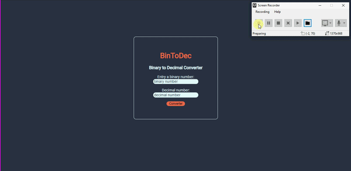

# Bin-To-Dec
Binary number converter to decimal number.

This is a simple program that I made a few months ago, using only JS, CSS and HTML.

<!-- Carregando o gif. -->

<!-- 
Mostrando o gif.

 -->
